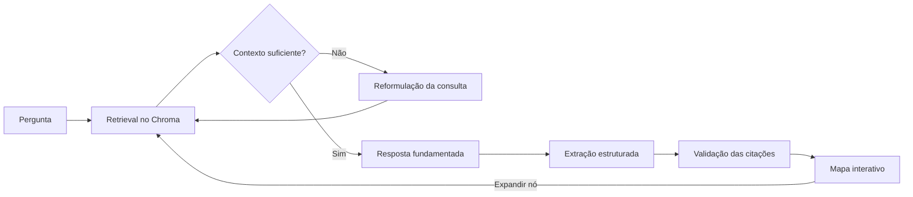

# Mapa Mitológico RAG

[](https://www.python.org/)
[](https://fastapi.tiangolo.com/)
[](https://www.langchain.com/langgraph)
[](#testes)

Um **mapa mental vivo de mitologia grega** que transforma respostas fundamentadas
em um grafo interativo. Em vez de esconder o RAG atrás de um chat tradicional, o
projeto torna visíveis os conceitos recuperados, suas conexões e os trechos exatos
do documento que sustentam cada nó.

Projeto desenvolvido para o **Challenge Alura/Oracle Next Education — Track Tech
AI Builder**.

## Por que um mapa mental vivo?

Uma pergunta cria o primeiro nó. A resposta fundamentada dá origem a deuses,
heróis, lugares e eventos. Ao selecionar um conceito, a interface mostra sua
citação e página de origem; ao expandi-lo, uma nova consulta RAG acrescenta outra
camada ao mapa.

- Grafo hierárquico da esquerda para a direita.
- Nós rastreáveis até o chunk original.
- Expansão interativa de qualquer conceito.
- Pan, zoom e enquadramento do mapa.
- Respostas produzidas somente a partir do contexto aprovado.
- Validação literal das citações para reduzir alucinações.

## Arquitetura



O ciclo de recuperação é orquestrado com LangGraph e limitado a três tentativas.
Se os chunks não atingirem o score mínimo, o Claude reformula a busca. Uma
resposta só é gerada após a aprovação determinística do contexto.

### Fluxo dos dados

1. O PDF é extraído e normalizado pelo `pypdf`.
2. O texto é dividido em chunks com overlap e IDs determinísticos.
3. O FastEmbed gera embeddings locais e o Chroma os persiste em disco.
4. A pergunta recupera os chunks semanticamente mais próximos.
5. O Claude sintetiza a resposta e devolve citações estruturadas.
6. O sistema valida cada citação contra o texto real do chunk.
7. Conceitos validados viram nós ligados à pergunta ou ao conceito expandido.

## Tecnologias

| Camada | Tecnologia |
| --- | --- |
| Backend e API | Python 3.14, FastAPI, Uvicorn |
| Orquestração | LangChain e LangGraph |
| LLM | Claude Haiku 4.5 via Anthropic |
| Embeddings | FastEmbed/ONNX, modelo multilíngue MiniLM |
| Vector store | ChromaDB local e persistente |
| Extração de PDF | pypdf |
| Interface | HTML, CSS, JavaScript e SVG |
| Testes | unittest e TestClient do FastAPI |

## Estrutura do projeto

```text
.
├── app.py                    # interface web e rotas /query e /expand
├── data/                     # corpus em domínio público
├── screenshots/              # evidências locais e do deploy
├── src/
│   ├── config.py             # configuração por variáveis de ambiente
│   ├── generation.py         # LLM, respostas e reformulação
│   ├── graph_extraction.py   # conceitos estruturados do grafo
│   ├── grounding.py          # validação literal das citações
│   ├── ingest.py             # extração, limpeza e chunking
│   ├── retrieval.py          # recuperação e avaliação de relevância
│   ├── vector_store.py       # embeddings e persistência no Chroma
│   └── workflow.py           # grafo de execução do agente
├── static/                   # mapa SVG e identidade visual
├── templates/                # página principal
├── tests/                    # testes unitários e de integração
├── .env.example
└── requirements.txt
```

## Execução local

### Pré-requisitos

- Python 3.14
- Git
- Chave da API Anthropic

### 1. Clone e prepare o ambiente

```bash
git clone https://github.com/Dev-Russo/rag-mitologia.git
cd rag-mitologia
```

No Windows PowerShell:

```powershell
py -3.14 -m venv .venv
.\.venv\Scripts\Activate.ps1
python -m pip install --upgrade pip
python -m pip install -r requirements.txt
Copy-Item .env.example .env
```

No Linux:

```bash
python3.14 -m venv .venv
source .venv/bin/activate
python -m pip install --upgrade pip
python -m pip install -r requirements.txt
cp .env.example .env
```

Preencha a chave no `.env`:

```dotenv
ANTHROPIC_API_KEY=sua_chave_aqui
```

O `.env` é ignorado pelo Git e nunca deve ser versionado.

### 2. Prepare o banco vetorial

O repositório inclui *The Age of Fable, or, Stories of Gods and Heroes*, de
Thomas Bulfinch, obtido no [Internet Archive](https://archive.org/details/ageoffableorstor00bulf_0)
e disponível em domínio público.

```bash
python -m src.ingest data/ageoffableorstor00bulf_0.pdf --rebuild
```

O primeiro uso do FastEmbed baixa o modelo de embeddings. A coleção resultante é
gravada em `chroma_db/` e não é versionada.

Para testar somente a extração e o chunking:

```bash
python -m src.ingest data/ageoffableorstor00bulf_0.pdf --prepare-only
```

### 3. Inicie a aplicação

```bash
uvicorn app:app --reload
```

- Interface: <http://127.0.0.1:8000>
- Health check: <http://127.0.0.1:8000/health>
- OpenAPI: <http://127.0.0.1:8000/docs>

Se a porta estiver ocupada no Windows:

```powershell
uvicorn app:app --reload --port 8001
```

## Exemplos

### Quem são os filhos de Zeus?

O agente recupera o trecho em que Júpiter/Zeus aparece disfarçado de cisne e
constrói um mapa com conceitos como:

```text
Quem são os filhos de Zeus?
├── Zeus
├── Castor
├── Pollux
├── Helen
├── Leda
└── Guerra de Troia
```

Cada conceito mantém seu `chunk_id`, trecho literal, página e score. A seleção de
`Helen`, por exemplo, apresenta o trecho que a relaciona à Guerra de Troia.

Outras perguntas úteis:

- `Qual é a relação entre Perséfone e Hades?`
- `Quem ajudou Perseu a derrotar Medusa?`
- `O que aconteceu durante a Guerra de Troia?`
- `Qual é a origem de Minerva segundo o documento?`

> O livro usa nomes gregos e romanos em diferentes passagens, como Zeus/Júpiter
> e Atena/Minerva. O agente preserva a terminologia encontrada nos trechos.

## API

### `POST /query`

Cria um novo mapa:

```json
{
  "question": "Quem são os filhos de Zeus?"
}
```

### `POST /expand`

Expande um nó existente:

```json
{
  "node_id": "concept:2fd805bb52808616",
  "concept": "Zeus"
}
```

As duas rotas retornam o mesmo contrato:

```json
{
  "status": "ok",
  "answer": "Resposta fundamentada em português.",
  "evaluation": {
    "sufficient": true,
    "attempts": 1,
    "final_query": "consulta utilizada",
    "max_score": 0.61
  },
  "nodes": [],
  "edges": [],
  "sources": []
}
```

- `ok`: resposta e grafo produzidos com evidências.
- `insufficient`: o corpus não contém evidência suficiente.
- `error`: falha controlada; a API responde HTTP 503 sem expor detalhes internos.

## Configuração

| Variável | Finalidade | Padrão |
| --- | --- | --- |
| `ANTHROPIC_API_KEY` | Credencial da Anthropic | obrigatório para consultas |
| `ANTHROPIC_MODEL` | Modelo de geração | `claude-haiku-4-5` |
| `CHROMA_PATH` | Banco vetorial local | `./chroma_db` |
| `CHROMA_COLLECTION` | Nome da coleção | `bulfinch_mythology` |
| `EMBEDDING_MODEL` | Modelo de embeddings | `sentence-transformers/paraphrase-multilingual-MiniLM-L12-v2` |
| `PDF_PATH` | Corpus padrão | `./data/ageoffableorstor00bulf_0.pdf` |
| `RETRIEVAL_TOP_K` | Chunks recuperados por tentativa | `5` |
| `RETRIEVAL_MIN_SCORE` | Score mínimo aprovado | `0.40` |
| `MAX_RETRIEVAL_ATTEMPTS` | Máximo de recuperações | `3` |

## Testes

Os testes não consomem a API Anthropic; as chamadas ao LLM são substituídas por
dublês determinísticos.

```bash
python -m unittest discover -s tests -v
python -m pip check
```

A suíte cobre ingestão, IDs determinísticos, embeddings, retrieval, avaliação,
reformulação, grounding, extração de conceitos, workflow, API e regressões do
frontend.

## Deploy na OCI Compute

O projeto foi desenhado para uma VM Linux da camada gratuita da OCI.

### 1. Infraestrutura

1. Crie uma instância Ubuntu ou Oracle Linux e associe um IP público.
2. Na Security List ou Network Security Group, libere TCP `80` para
   `0.0.0.0/0`.
3. Acesse a VM por SSH e clone este repositório.
4. Instale Python 3.14, crie o `.venv`, instale as dependências e configure o
   `.env`.
5. Execute a ingestão do PDF na própria VM.

### 2. Serviço

Crie `/etc/systemd/system/mapa-mitologico.service`, ajustando usuário e caminhos:

```ini
[Unit]
Description=Mapa Mitológico RAG
After=network.target

[Service]
User=ubuntu
WorkingDirectory=/home/ubuntu/rag-mitologia
EnvironmentFile=/home/ubuntu/rag-mitologia/.env
ExecStart=/home/ubuntu/rag-mitologia/.venv/bin/uvicorn app:app --host 127.0.0.1 --port 8000
Restart=always
RestartSec=5

[Install]
WantedBy=multi-user.target
```

Ative o serviço:

```bash
sudo systemctl daemon-reload
sudo systemctl enable --now mapa-mitologico
sudo systemctl status mapa-mitologico
```

### 3. Proxy público

Instale o Nginx e direcione a porta 80 para o Uvicorn:

```nginx
server {
    listen 80;
    server_name _;

    location / {
        proxy_pass http://127.0.0.1:8000;
        proxy_set_header Host $host;
        proxy_set_header X-Real-IP $remote_addr;
        proxy_set_header X-Forwarded-For $proxy_add_x_forwarded_for;
        proxy_set_header X-Forwarded-Proto $scheme;
    }
}
```

Libere a porta também no firewall do sistema operacional, se estiver ativo, e
registre em `screenshots/` a interface acessível pelo IP público e o health
check. Essas evidências completarão o requisito de deploy do challenge.

## Status do challenge

- [x] Agente funcional baseado em documento.
- [x] Leitura, chunking, embeddings e vector store persistente.
- [x] RAG com avaliação, reformulação e grounding.
- [x] Mapa interativo com expansão e fontes rastreáveis.
- [x] Testes automatizados.
- [x] Repositório organizado e histórico incremental.
- [ ] Deploy público na OCI.
- [ ] Screenshots finais do deploy.

## Desenvolvimento

O histórico segue Conventional Commits com mensagens em português. Mudanças
independentes são registradas em commits pequenos:

```text
feat: implementa ingestão do documento
fix: preserva metadados ao recuperar chunks
docs: adiciona instruções de deploy na OCI
test: cobre expansão dos nós do grafo
chore: atualiza dependências do projeto
```
